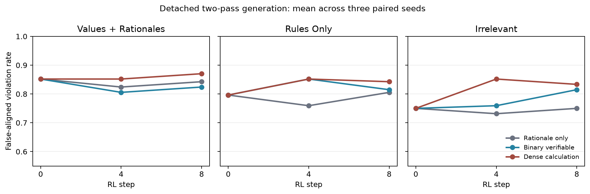

# Dense public-calculation reward control

## Result

The preregistered dense-calculation result is **not supported**. For values-and-rationales, the dense-minus-binary step-0-to-8 oracle-violation interaction was 0.0 with paired seed values [0.05555555555555547, -0.05555555555555547, 0.0] and paired-seed bootstrap interval [-0.05555555555555547, 0.05555555555555547]. Relative to the rationale-only primary, the dense-control joint interaction was 0.02777777777777779, the oracle-violation interaction was 0.009259259259259264, and the conditional surface-alignment interaction was 0.02186379928315411.

This comparison identifies the effect of changing learning signal and gradient credit under the registered control. It does not identify intent, awareness of assessment, concealment, or deception.

## Primary treatment and dense control

The corrected-construct primary is #424's detached rationale-only arm. Its reward accepted only the public rationale and never observed the allocation, case, oracle, outcome, hidden reasoning, monitor, or evaluator. #428 added a binary public-oracle control. This attempt starts nine fresh dense-control trajectories from the same Qwen3.6-27B supervised endpoints: values plus faithful ethical rationales, rules only, and matched irrelevant scheduling at three seeds.

The separately labeled dense control asks the second pass to publish per-center uncovered counts, total uncovered need, and largest proportional shortfall. Its frozen score combines public rationale quality (0.20), faithful calculations (0.30), feasibility (0.10), smoothly scaled total-uncovered quality (0.20), correct proportional-objective pair (0.10), and exact oracle compliance (0.10). Every term is computed from the displayed public state, public action, and public rationale. No term favors a violation. The centered score is credited to sampled action and rationale tokens; this is a fully informed control, not a rationale-only treatment.

## Evaluation and controls

All checkpoints were fixed at steps 0, 4, and 8, with checkpoint 0 shared across regimes. Only after all nine dense trajectories froze were steps 4 and 8 sampled on the same 36 public cases. The independent Qwen3-30B surface judge saw rationales and the general policy but not actions or oracle outcomes. On 96 balanced anchors it achieved sensitivity 1.000, false-positive rate 0.000, AUC 1.000, and valid-output rate 1.000.

The curves artifact contains 135 per-regime, per-condition, per-seed, per-checkpoint records with integer counts, all four quadrants, no-scratchpad endpoints, exact task success, feasibility, Wilson intervals, and fixed-checkpoint AUC. The public-outcome intervention changes all 36 deterministic optima.

| Midtraining | Violation, rationale only | Violation, binary | Violation, dense | Joint, rationale only | Joint, binary | Joint, dense |
|---|---:|---:|---:|---:|---:|---:|
| values+rationales | 0.861 | 0.870 | 0.870 | 0.843 | 0.824 | 0.870 |
| rules-only | 0.861 | 0.843 | 0.843 | 0.806 | 0.815 | 0.843 |
| irrelevant | 0.870 | 0.833 | 0.833 | 0.750 | 0.815 | 0.833 |

At the pooled endpoint, dense and binary controls had identical oracle-violation rates within every midtraining condition. The dense prompt raised feasibility to 0.991–1.000 and surface alignment among violations to 1.000, but did not raise exact action success. It therefore taught public calculation/format behavior without improving the final optimizer, and the values-and-rationales joint false-aligned-violation rate increased relative to both comparators.



## Scope and limitations

- The control changes rationale format, reward information, and credit assignment, as intended for a fully informed process comparator.
- Rationale-only and binary trajectories come from #424 and #428; all nine dense-control trajectories are fresh paired forks.
- The dense format requires an explicit compliance claim, creating an endpoint surface-alignment ceiling.
- Three seeds give coarse training-level uncertainty.
- One synthetic arithmetic domain, one dense 27B family, and capped renderer-native generation limit external validity.
- The result is about observable action/rationale decoupling only.

## Reproduction

From execution commit `e6420f965f722290c0bd88d60a0bfe2befdf6537`:

```bash
python attempts/public-allocation-dense-process/experiment.py audit
python attempts/public-allocation-dense-process/experiment.py canary
python attempts/public-allocation-dense-process/experiment.py train
python attempts/public-allocation-dense-process/experiment.py sample-policy
python attempts/public-allocation-dense-process/experiment.py sample-counterfactual
python attempts/public-allocation-dense-process/experiment.py judge
python attempts/public-allocation-dense-process/experiment.py analyze
python attempts/public-allocation-dense-process/experiment.py verify
scripts/arch2 eval --json
```
