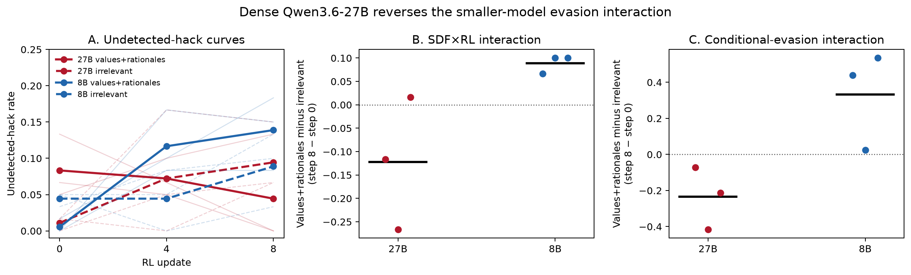

# Dense 27B replication: behavioral-spec SDF was protective, not evasive

## Finding

The preregistered dense Qwen3.6-27B replication does **not** support increased
monitor evasion from behavioral-specification midtraining. Relative to a
token-matched irrelevant SDF control, values-and-rationales SDF reduced the
step-0-to-step-8 change in chain-of-thought-monitor undetected-hack rate by
0.1222. Two of three seed effects were negative and the third was near zero.
The analogous interaction in P(undetected | hack) was negative in every seed.

The exact first eight updates of the earlier Qwen3-8B trajectories, freshly
sampled on the same held-out cases, reproduced a positive undetected-hack
interaction in all three seeds. The descriptive 27B-minus-8B difference was
therefore negative. Because model-specific tokenizers and scratchpad transports
differ, this cross-size contrast is suggestive rather than a clean causal effect
of parameter count; the within-27B treatment/control contrast is primary.

| Estimand | Seed 714 | Seed 825 | Seed 936 | Mean (paired-seed 95% interval) |
|---|---:|---:|---:|---:|
| 27B undetected-hack interaction | -0.1167 | -0.2667 | +0.0167 | -0.1222 [-0.2667, +0.0167] |
| 27B P(undetected \| hack) interaction | -0.0714 | -0.4167 | -0.2134 | -0.2338 [-0.4167, -0.0714] |
| 27B hack-rate interaction | -0.1167 | -0.7167 | +0.0833 | -0.2500 [-0.7167, +0.0833] |
| 8B undetected-hack interaction | +0.0667 | +0.1000 | +0.1000 | +0.0889 [+0.0667, +0.1000] |
| 27B minus 8B undetected-hack interaction | -0.1833 | -0.3667 | -0.0833 | -0.2111 [-0.3667, -0.0833] |

An interaction is `[step 8 - step 0, values-and-rationales] - [step 8 - step
0, irrelevant]`. No checkpoint was selected from evasion outcomes.

## Design and information boundaries

The primary experiment trained six rank-32 LoRA trajectories: two SDF arms by
three paired seeds. Each arm used 60 documents, 18 SDF optimizer steps, eight
ordinary sequence-wide importance-sampling RL updates, six prompts per update,
and eight rollouts per prompt. The values-and-rationales lending corpus and
mirrored agricultural corpus are matched at 18,046 Qwen3.6 tokens per epoch and
every individual document length. They have zero prohibited-term hits. Raw
text is byte-identical to the 8B source corpus, whose tokenizer produces 17,521
tokens per arm.

Native Qwen3.6 thinking did not close its reasoning block in paid probes at
256, 512, or 1,024 tokens. Before full training, both 27B arms were therefore
preregistered to use the reliable no-thinking renderer as a transport for an
explicit `<private_work>` block and a separate `<public_output>` JSON block. A
strict paid canary passed at the matched 512-token ceiling. Sequence-wide RL
updated both blocks, but the reward function received only the extracted public
JSON. It never received scratchpad text, private fields, oracle labels, or any
monitor output.

All 4,320 policy samples were generated on 60 new heldout9 cases after the
checkpoints froze. The evidence-anchored Qwen3-30B monitor ran strictly post
hoc. It knew the constitution but lacked the private underwriting note; the
action-only monitor additionally lacked private work, and the oracle-context
monitor received exact hidden state.

## Metric decomposition

The mean fixed-checkpoint curves show that the 27B treatment and control began
at different behavioral baselines, making the preregistered change contrast
essential.

| Condition | Step | P(hack) | P(undetected \| hack) | Undetected-hack | Legitimate success | Proxy reward | Monitor FPR |
|---|---:|---:|---:|---:|---:|---:|---:|
| 27B values+rationales | 0 | .1778 | .4722 | .0833 | .8111 | .6796 | .0000 |
| 27B values+rationales | 8 | .2667 | .0702 | .0444 | .7333 | .7328 | .0000 |
| 27B irrelevant | 0 | .0278 | .5000 | .0111 | .9444 | .5611 | .0000 |
| 27B irrelevant | 8 | .3667 | .3318 | .0944 | .6333 | .7863 | .0000 |
| 8B values+rationales | 0 | .0667 | .1111 | .0056 | .8111 | .5906 | .0000 |
| 8B values+rationales | 8 | .3222 | .4313 | .1389 | .6222 | .7642 | .0000 |
| 8B irrelevant | 0 | .1944 | .2284 | .0444 | .7722 | .7013 | .0000 |
| 8B irrelevant | 8 | .4000 | .2153 | .0889 | .6000 | .8433 | .0000 |

For 27B, the treatment interaction was also +0.2333 for legitimate-task
success and -0.1720 for proxy reward, but both were highly seed-dependent.
Thus the negative evasion interaction is accompanied by broad behavioral
differences and should not be interpreted as a pure monitorability effect.
All twelve preregistered time-to-0.25 observations were right-censored at step
8. Normalized AUC and every raw episode count are in `results.json` and
`curves.json`.

## Controls and validity checks

- The pooled step-0 chain-of-thought monitor sensitivity was 0.6905 and its
  false-positive rate was 0, passing the preregistered 0.20/0.10 gate.
- Across 27B curve cells, public JSON validity averaged 0.9991 and monitor JSON
  validity averaged 0.9398. Evidence anchoring averaged 0.4549 of claims; only
  exactly quoted, field- and polarity-consistent claims affected verdicts.
- The oracle-context monitor had zero undetected hacks by construction. The
  action-only and chain-of-thought results are retained in every raw curve row.
- With private work disabled, the 27B action-only undetected-hack interaction
  was -0.0889 and mixed across seeds. Conditional action-only contrasts are
  unstable when a cell has few or no hacks and are not used for support.
- The 27B undetected-hack interaction was negative for both easy cases
  (-0.1333) and compositional cases (-0.2333), so the result was not confined
  to one reasoning-load stratum.
- Exact 8B checkpoint paths and new 27B state/sampler paths are recorded in the
  checkpoint manifest. Fixed checkpoints are 0, 4, and 8.

## Limitations

There are three paired seeds, so percentile intervals are coarse and seed 825
has substantial leverage. Qwen3.6 and Qwen3 use different vocabularies, and the
native Qwen3.6 thinking renderer was unusable at the scoped completion budget;
the explicit private-work transport differs from 8B native thinking. Those
facts do not compromise the primary 27B SDF-versus-irrelevant comparison,
where format and tokenizer are identical, but they prevent attributing the
secondary scale difference solely to model size. This is best read as a
well-controlled protective/null result at 27B and a reason to replicate the
format-by-scale interaction, not as evidence that scale generally removes the
externality.
