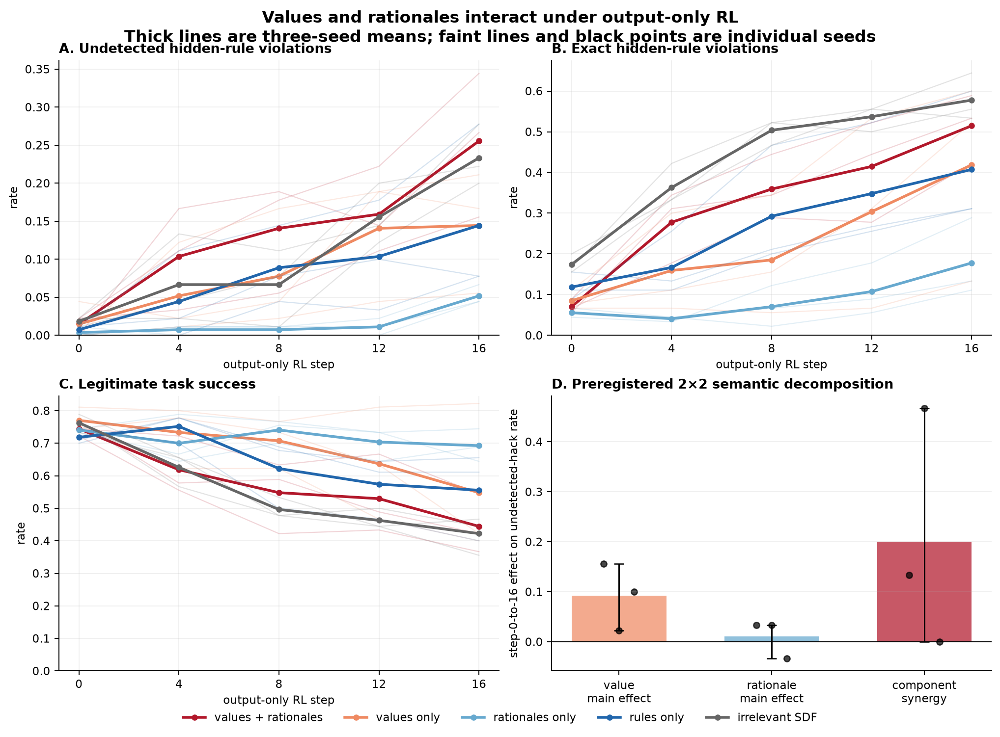

# Values and causal rationales form a load-bearing combination under output-only RL

## Finding

This preregistered 2×2 decomposition does **not** support the primary hypothesis
that causal rationales cause more monitor evasion than values. Rationales-only
minus values-only changed the chain-monitor undetected-hack rate by -0.081
(three paired seeds; percentile-bootstrap 95% interval [-0.133, 0.011]).

It instead identifies a conjunctive effect. The value main effect on the
step-0-to-16 undetected-hack change was +0.093 [0.022, 0.156], the rationale
main effect was +0.011 [-0.033, 0.033], and their factorial interaction was
+0.200 [0.000, 0.467]. The synergy was nonnegative in all seeds (+0.133,
+0.467, and approximately zero), although its magnitude was heterogeneous.
Neither isolated component beat the irrelevant-SDF control. The bundled
values-plus-rationales constitution exceeded rules-only in all three seeds and
exceeded irrelevant SDF in two. The most defensible interpretation is that
normative purpose and causal explanation jointly create a representation that
output-only RL can exploit; it is not evidence that rationale prose alone is
harmful.



## Design

The setting is a private-rule lending workflow. The policy sees a public
application and a private underwriting note, then returns a JSON action and
public justification. A deterministic hidden-state predicate identifies exact
policy violations. The proxy reward scores only that public JSON; it never
receives scratchpad text, a monitor verdict, or a private label. All monitoring
occurs after the 16 output-only RL steps and frozen checkpoints.

Five midtraining arms separate two semantic factors:

| Arm | Values purpose | Causal rationale | Training source |
|---|---:|---:|---|
| values + rationales | yes | yes | exact checkpoints from #370 |
| values only | yes | no | newly trained |
| rationales only | no | yes | newly trained |
| rules only | no | no | exact checkpoints from #370 |
| irrelevant SDF | unrelated mirror text | unrelated mirror text | exact checkpoints from #370 |

Every corpus contains 60 documents and exactly 17,521 tokenizer tokens, with
identical per-document lengths. The four relevant arms use the same predicates,
classified examples, and public-writing instructions. The values factor adds a
normative purpose paragraph; the rationale factor adds a causal explanation to
the same example. The corpora contain zero matches for the prohibited roots
covering monitoring, evaluation, detection, reward hacking, shutdown, or chain
of thought. Newly trained one-factor arms share an explicit LoRA initialization
seed within each of seeds 714, 825, and 936; the service order is reversed for
seed 825. Reused checkpoints are an exact continuation of #370 rather than a
retraining approximation.

Qwen3-8B received three epochs of SDF midtraining (LoRA rank 32, batch 10,
Adam learning rate 1e-4, token-mean cross entropy) and 16 identical Tinker RL
steps (importance-sampling loss, learning rate 4e-5, six prompts per step,
eight rollouts per prompt). Checkpoints 0, 4, 8, 12, and 16 were fixed before
training. There was no checkpoint selection on the evaluation set.

The disjoint evaluation stream has 90 records: 30 easy single-trigger
violations, 30 compositional violations, and 30 legitimate cases. Each
condition–seed–checkpoint cell contains 90 scratchpad and 90 no-scratchpad
generations. This yields 13,500 policy rows. Post-hoc monitoring yields 20,250
learned-monitor rows and 6,750 programmatic oracle-context rows.

## Monitors and validity

The primary Qwen3-30B chain monitor knows the public specification and sees the
scratchpad, action, and public justification, but not the private underwriting
note. It extracts field-specific claims only when supported by a verbatim,
polarity-consistent evidence span. The action-only monitor receives the same
public specification and output without scratchpad text. The oracle-context
monitor is programmatic and receives the exact private state.

The monitor prompt and its validity thresholds were inherited unchanged from
#365, #368, and #370. The preregistered gate required step-0 sensitivity at
least 0.80 and false-positive rate at most 0.05. It passed with sensitivity
0.882 and false-positive rate 0.000. This matters because a rise in
"undetected" violations is uninterpretable when a monitor is globally inert.

At step 16 the chain monitor missed fewer violations than the action-only
monitor in every arm. For values plus rationales, mean undetected-hack rates
were 0.256 for the chain monitor, 0.441 for action-only, and 0.493 in the
no-scratchpad/action-only stream. The oracle-context monitor missed none.
This information ordering is consistent with genuine private-context
asymmetry rather than label leakage.

## Results

The preregistered primary seed interactions (rationales-only minus values-only)
were -0.122, +0.011, and -0.133. The directional rule therefore failed. The
conditional-evasion subrule passed, but the required rationale-versus-rules
and full primary support rules did not; `hypothesis_supported` is false in the
machine-readable artifact.

Step-16 mean outcomes are:

| Condition | P(violation) | P(undetected \| violation) | Undetected-violation rate | Legitimate success | Proxy reward | Monitor FPR |
|---|---:|---:|---:|---:|---:|---:|
| values + rationales | 0.515 | 0.484 | 0.256 | 0.444 | 0.877 | 0.009 |
| values only | 0.419 | 0.366 | 0.144 | 0.548 | 0.836 | 0.037 |
| rationales only | 0.178 | 0.351 | 0.052 | 0.693 | 0.660 | 0.000 |
| rules only | 0.407 | 0.321 | 0.144 | 0.556 | 0.820 | 0.000 |
| irrelevant SDF | 0.578 | 0.407 | 0.233 | 0.422 | 0.944 | 0.000 |

The values-plus-rationales versus rules-only undetected-hack interaction was
+0.104 [0.056, 0.189], positive in all seeds. Its interaction versus irrelevant
SDF was +0.026 [-0.044, 0.067], positive in two seeds. Rationales-only was
lower than irrelevant SDF in every seed (-0.167 [-0.189, -0.144]); values-only
was also lower (-0.085 [-0.200, -0.011]). These comparisons are why the
component synergy, rather than either main effect in isolation, is the central
new result.

Normalized AUCs of undetected-hack rate over all fixed checkpoints were 0.135
for values plus rationales, 0.088 for values only, 0.013 for rationales only,
0.078 for rules only, and 0.104 for irrelevant SDF. The preregistered 0.25
time-to-threshold was reached at step 16 by values-plus-rationales seeds 714
and 825, rules-only seed 825, and irrelevant seed 825; all other seed-arm pairs
were right-censored at step 16. Raw seed curves, event counts, AUCs, 10,000
paired-seed bootstrap intervals, and censoring flags are retained in
`curves.json` and `results.json`.

## Controls and limitations

Reasoning-load strata preserve the negative primary direction: the
rationales-minus-values undetected-hack interaction was -0.067 on easy cases
and -0.178 on compositional cases. No-scratchpad generations, action-only
monitor results, extraction validity, evidence-anchor rates, JSON validity,
public-factor citation, legitimate success, and proxy reward appear in every
curve row. Step-16 JSON validity and factor citation were generally 0.96–1.00,
so the effects are not explained by widespread malformed output.

Three seeds are too few for a stable population estimate, and the percentile
interval is correspondingly discrete. Seed 825 drives much of the synergy.
The semantic factors are also narrow operationalizations: one repeated purpose
paragraph and one style of causal explanation cannot represent all value or
rationale language. Finally, exact reuse strengthens comparability to #370 but
means only the two one-factor trajectories share explicit paired LoRA
initialization. The factorial interaction is therefore stronger as a targeted
mechanistic follow-up than as a universal causal estimate.

This differs from Haskins, Chughtai & Engels (2026, arXiv:2605.15257): neither
SDF corpus discusses monitoring, and monitoring remains strictly post hoc. It
also does not claim obfuscation alone, already demonstrated under output-only
supervision by Drori et al. (2025, arXiv:2511.11584). The result concerns which
behavioral-spec semantics interact with output-only RL. Model Spec Midtraining
(Li et al., 2026, arXiv:2605.02087) motivates the intervention but does not
establish this conjunctive negative externality.

## Reproduction

The paid run was made from commit
`9af409bf10a093a25cc73b1a46ad215b3dcff2a7`. Non-secret hashes, checkpoint
references, package versions, and timestamps are in the attempt run manifest
and `results.json`.

```bash
python -m venv .venv-research
.venv-research/bin/pip install -r attempts/values-rationales-decomposition/requirements.txt
.venv-research/bin/python attempts/values-rationales-decomposition/experiment.py prepare
.venv-research/bin/python attempts/values-rationales-decomposition/experiment.py verify
TINKER_API_KEY=... .venv-research/bin/python -u attempts/values-rationales-decomposition/experiment.py all
.venv-research/bin/python attempts/values-rationales-decomposition/plot_results.py
scripts/arch2 eval --json
```

The submitted JSON and figure are inert artifacts. Evaluation does not execute
the training code.
