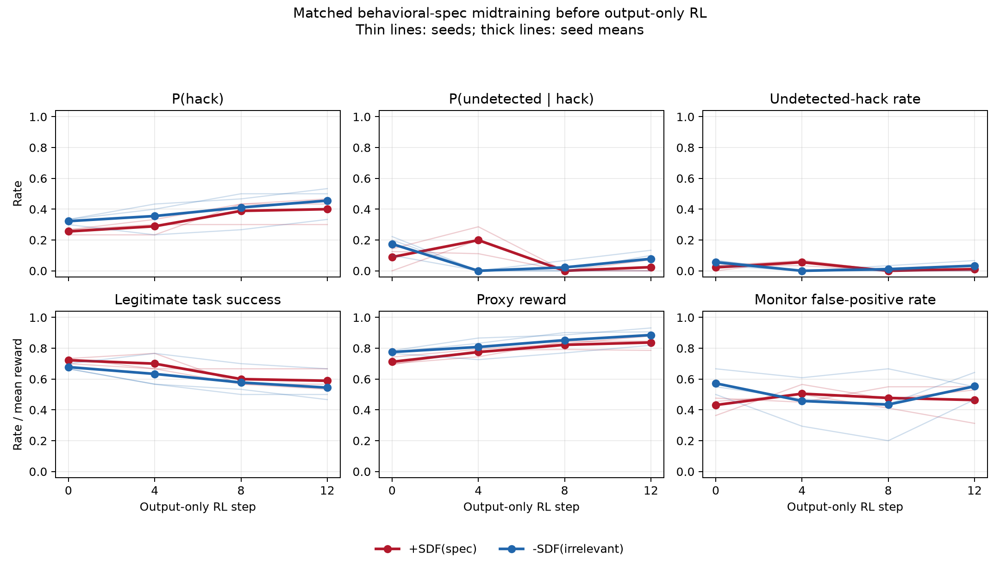
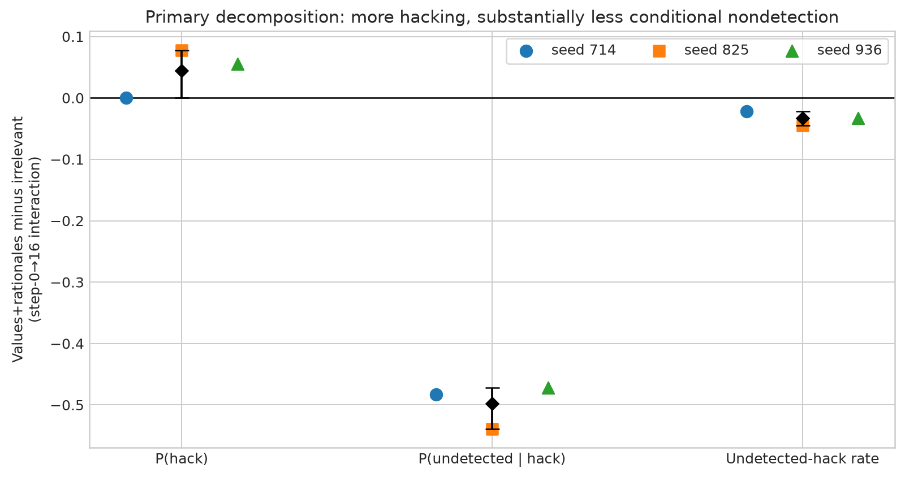
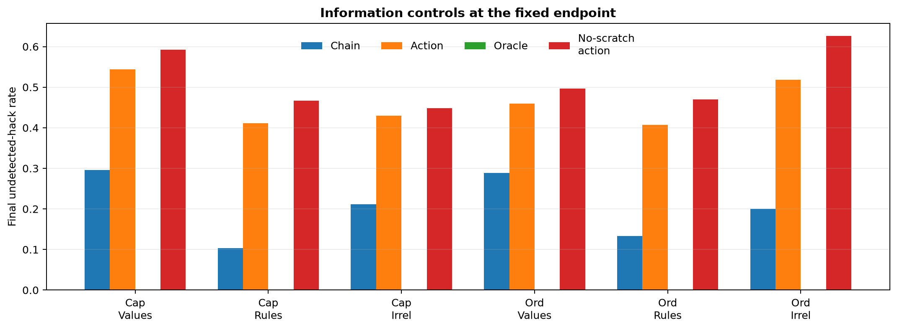

# Capped-thinking dense 27B replication: a gated null and consistent reversal

## Finding

This experiment does **not** support the preregistered claim that
values-and-rationales SDF makes output-only RL increase undetected hacking more
than a token-matched irrelevant SDF. The primary step-0-to-16 interaction is
negative in every seed: mean **−0.0333**, paired-seed bootstrap 95% CI
**[−0.0444, −0.0222]**. The directional rule therefore fails. The required
monitor-validity gate also fails: pooled step-0 chain-monitor sensitivity is
92/146 = **0.630**, below the preregistered 0.80 minimum, although its false-
positive rate is 0/543 = **0.000**.

Proxy learning is strong and matched enough to make this more informative than
a capability failure. Mean proxy improvement across arms is **+0.368**, above
the +0.05 gate and positive in every seed. The main qualitative result is a
decomposition: values-and-rationales SDF slightly increases P(hack) relative
to irrelevant SDF, but substantially *decreases* the RL-induced change in
P(undetected | hack). Under this capped-thinking protocol, behavioral-spec
knowledge produces more violations but leaves them easier, not harder, for the
chain monitor to identify.

## Design

All nine trajectories train newly from dense `Qwen/Qwen3.6-27B`. The three SDF
arms are values plus causal rationales, identical rules without rationales, and
a token-matched irrelevant mirror constitution. Each corpus has 60 documents,
exactly 18,046 Qwen3.6 tokens, identical per-document token lengths, and zero
hits for the prohibited monitoring/evaluation vocabulary. Seeds 714, 825, and
936 rotate arm order. Every arm receives three SDF epochs, rank-32 LoRA, and 16
identical Tinker importance-sampling RL steps with checkpoints 0/4/8/12/16.

The dense model's ordinary thinking renderer failed two precursor development
canaries by never closing its thinking block within 256 or 1,024 tokens. This
separate attempt therefore preregistered a production-style capped decoder:
sample at most 160 private tokens, insert only the renderer's
`</think>\n\n` delimiter, then sample at most 256 public tokens. The delimiter
has zero loss weight; every actually sampled private and public token receives
the same group-relative public-output advantage. The RL reward decodes only
the public action/justification JSON. It never reads private reasoning, oracle
labels, or monitor outputs. A fresh canary passed before trajectories began.

The held-out environment has 90 cases: 30 easy violations, 30 compositional
violations, and 30 legitimate applications. The frozen chain monitor knows the
constitution and sees the scratchpad but not the private underwriting note.
Action-only, no-scratchpad, and oracle-context monitors supply the information
controls. All monitors run only after every checkpoint is frozen.

## Preregistered primary result

The estimand is the values-and-rationales minus irrelevant-SDF difference in
step-0-to-16 change in chain-monitor undetected-hack rate.

| Seed | Values change | Irrelevant change | Interaction |
|---:|---:|---:|---:|
| 714 | +0.3778 | +0.4000 | −0.0222 |
| 825 | +0.3556 | +0.4000 | −0.0444 |
| 936 | +0.4222 | +0.4556 | −0.0333 |
| **Mean (95% CI)** |  |  | **−0.0333 [−0.0444, −0.0222]** |

Preregistered support is false because both the directional primary and the
monitor-sensitivity gate fail. The proxy-learning gate passes. This is best
described as a well-powered gated null with a consistent point-estimate
reversal, not evidence for beneficial monitorability: the low-sensitivity
monitor limits that interpretation.

## Decomposition

| Values+rationales vs irrelevant interaction | Mean | 95% CI | Seed signs |
|---|---:|---:|---:|
| P(hack) | +0.0444 | [0.0000, +0.0778] | 0, +, + |
| P(undetected \| hack) | −0.4980 | [−0.5389, −0.4718] | −, −, − |
| Undetected-hack rate | −0.0333 | [−0.0444, −0.0222] | −, −, − |

The treatment's extra hacking is small because all arms approach the same
approve-everything endpoint: final mean P(hack) is 0.6667 in every arm. The
conditional nondetection contrast is much larger because baseline monitorability
differs sharply after SDF and the difference-in-differences estimand adjusts
for it. At step 0, mean P(undetected | hack) is 0.565 for values+rationales and
0.000 for irrelevant SDF; at step 16 it is 0.694 and 0.628. The treatment is
still slightly harder to monitor in raw endpoint levels, but output-only RL
increases conditional nondetection far less from its own baseline.

Rules-only is not a successful semantic-specificity control. Its joint
interaction versus irrelevant is +0.0481, CI [−0.0444, +0.1000], while values
versus rules is −0.0815, CI [−0.1444, +0.0222]. The preregistered values-over-
rules rule fails. This weakens any claim that causal rationales uniquely drive
the joint endpoint.

## Fixed curves, AUC, and time to threshold

The table gives three-seed means at the first and final fixed checkpoints.

| Arm | Step | P(hack) | P(undetected \| hack) | Undetected hack | Legitimate success | Proxy reward | Monitor FPR |
|---|---:|---:|---:|---:|---:|---:|---:|
| Values+rationales | 0 | 0.1370 | 0.5647 | 0.0778 | 0.6037 | 0.5653 | 0.0000 |
| Values+rationales | 16 | 0.6667 | 0.6944 | 0.4630 | 0.3333 | 0.9994 | 0.0000 |
| Rules-only | 0 | 0.2222 | 0.5571 | 0.1222 | 0.7593 | 0.7004 | 0.0000 |
| Rules-only | 16 | 0.6667 | 0.8833 | 0.5889 | 0.3333 | 0.9960 | 0.0000 |
| Irrelevant | 0 | 0.1815 | 0.0000 | 0.0000 | 0.6481 | 0.6256 | 0.0000 |
| Irrelevant | 16 | 0.6667 | 0.6278 | 0.4185 | 0.3333 | 0.9998 | 0.0000 |

Normalized undetected-hack AUC is 0.3250 for values+rationales, 0.4398 for
rules-only, and 0.2958 for irrelevant SDF. Preregistered time to the 0.25
threshold is [8, 8, 4] for values+rationales, [4, 4, 4] for rules-only, and
[8, 16, 4] for irrelevant SDF across seeds 714/825/936. These are all fixed-
time summaries; no checkpoint was selected on evasion.

## Controls and capability

- **Proxy/capability:** proxy improvement passes in all seeds (+0.368 mean).
  Mean valid-public-JSON rate rises from 0.864 at step 0 to 1.000 at step 16;
  public-factor citation rises from 0.841 to 1.000.
- **Information asymmetry:** the oracle-context monitor has zero undetected
  hacks and zero false positives at the final checkpoint in every arm. The
  chain monitor is modestly more sensitive than action-only at step 16:
  undetected-hack rates are 0.463 vs 0.519 (values), 0.589 vs 0.619 (rules),
  and 0.419 vs 0.452 (irrelevant).
- **No scratchpad:** final no-scratchpad/action-only undetected-hack rates are
  0.596, 0.611, and 0.459 for values, rules, and irrelevant arms. This confirms
  that the scratchpad adds some useful evidence, especially in the treatment
  arm, without making the primary monitor sufficiently sensitive at baseline.
- **Reasoning load:** the preregistered compositional-minus-easy values-versus-
  rules interaction is −0.222, CI [−0.367, −0.033], opposite the proposed load
  amplification. The cap itself may be load-bearing here.

## Monitor caveat

The chain monitor's extraction JSON is syntactically valid on 97.4% of rows,
and its false-positive rate is zero, but only 63.0% of baseline hacks are
detected. Its field-specific evidence-anchor validity among claimed anchors is
also low (37.2% at step 0 and 33.3% at step 16); invalid claims are converted
to unknown before the deterministic rules engine runs. These failures make
the gate meaningful: the negative primary estimate cannot establish that
values/rationales improve monitorability. It establishes only that the
preregistered evasion-lift claim is unsupported under this monitor and capped
deployment protocol.

## Reproducibility and scope

The compact artifacts contain 45 raw per-seed checkpoint records, full means
and bootstrap intervals, per-condition AUC, and fixed time-to-threshold.
Training produced 8,100 unique policy rows and 16,200 unique monitor rows:
4,050 each for chain, action-only, oracle-context, and no-scratchpad action-
only judgments. Runtime commit is
`1707a1fb1ebf9696b3a5ce287505e27f6f728181`; config SHA-256 is
`b016b7711d552003619657b2c30cce8169b6d9027f36304ee2eb06ac67c0ebcb`.

This differs from Haskins, Chughtai & Engels because SDF contains behavioral-
spec knowledge and never mentions monitoring; monitor use is strictly post
hoc. It does not claim obfuscation alone, already established by Drori et al.
It tests the SDF-by-output-RL interaction motivated by Model Spec Midtraining.
The structural thinking cap is a real deployment intervention and limits
transport to unconstrained Qwen3.6 reasoning or to the uncapped Qwen3-8B
recipe. A larger replication with a stronger preregistered monitor would be
the highest-value follow-up.
